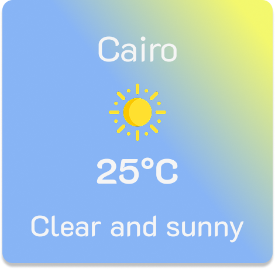
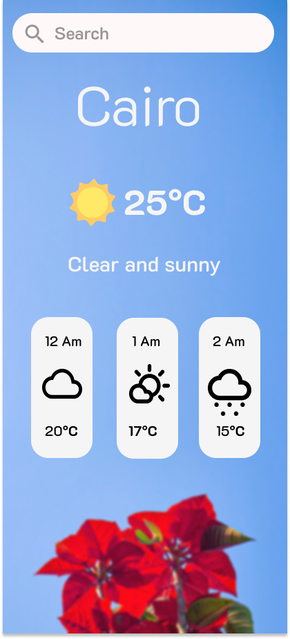

# Task 1: Weather Card

This task is about designing a small weather card that shows:
- City name
- Temperature
- Weather icon (sunny, rainy, etc.)
- Short description  

The design includes a second version for smaller mobile screen sizes.

## Design Preview  
Card Frame :  
  

Mobile Frame :  
  

---

## 🔗 Figma File
[View on Figma](https://www.figma.com/design/IB1eHubVdOJKmnTpBvZ2NV/Elevvo-Tasks?node-id=0-1&t=7Eu6u9rkBMPE6hsq-1)  
