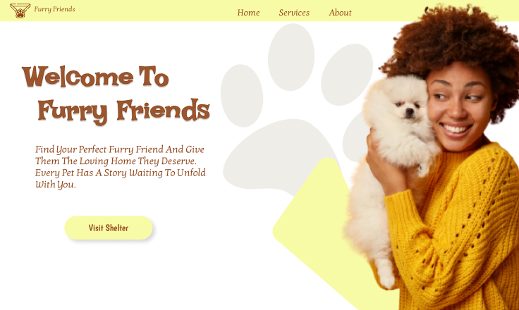
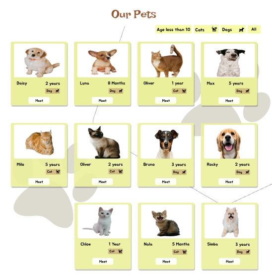
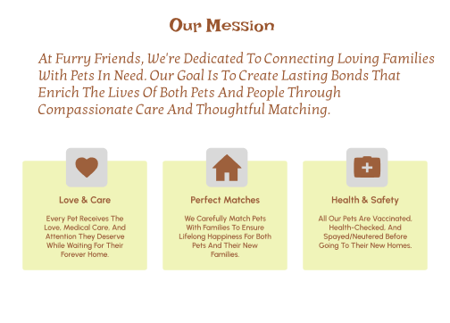
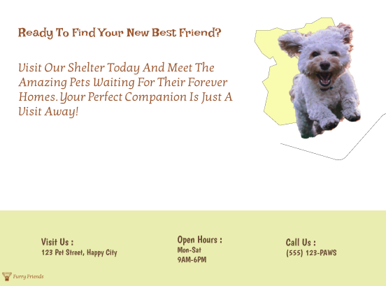
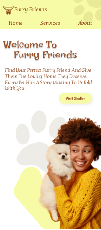
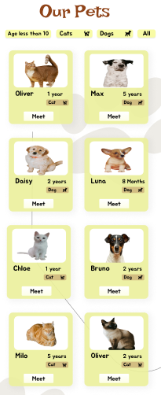
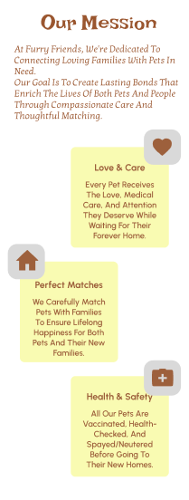
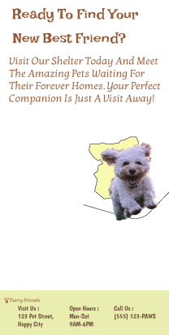

# Task 3: Pet Adoption Homepage 

## Description
For this task, I designed a **one-page homepage** for a pet adoption center.  
The design focuses on being **bright, friendly, and welcoming**, with sections that highlight pets and encourage adoption.

---

## Sections
- **Welcome Message** with a featured image  
- **Featured Pets** (image, name, and age)  
- **Mission Info** about the adoption center  
- **Call-to-Action** to "Visit the Shelter"  

---

## Design Notes
- Used **responsive design** to make it look great on both **desktop and mobile**  
- **Bright and friendly colors** to create a positive experience  
- **Large images** for better visual engagement  

---

## Bonus
- Added **filters** (Dog , Cat , Age range) to help users browse pets easily  

---

## Preview
### Desktop Version

### Mobile Version

